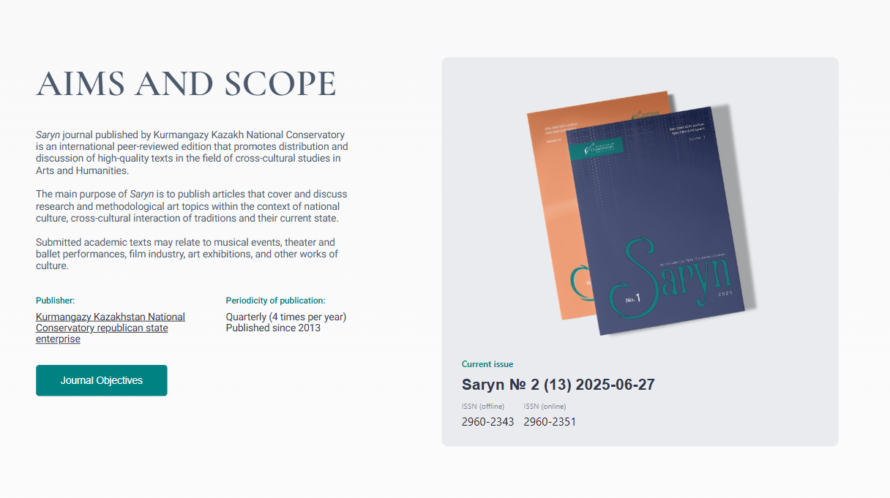

# Saryn Theme

A custom child theme for Open Journal Systems (OJS), built upon the default `healthSciences` theme. This theme was heavily customized to create a unique identity for the Saryn journal. It is fully responsive, providing an optimal viewing experience across all devices—from desktops to mobile phones.

## Live Demo

You can see this theme in action on the official website of the Saryn Journal:
**[https://sarynjournal.kz](https://sarynjournal.kz)**

## Base Theme & Credits

This theme is a direct modification of the **healthSciences** theme, created by the [Public Knowledge Project (PKP)](https://pkp.sfu.ca/). All core functionality and underlying code structure is credited to them.

- **Parent Theme Repository:** [https://github.com/pkp/healthSciences](https://github.com/pkp/healthSciences)
- **Parent Theme License:** GNU General Public License v3.0

## Features

- **Fully Responsive:** Carefully designed to adapt seamlessly to all screen sizes and devices.
- **Visual Branding:** Complete color scheme overhaul to match the Saryn journal's brand.
- **Typography:** Custom font stack for improved readability and a unique feel.

## Structure

As a child theme, this directory structure overrides specific files from the parent `healthSciences` theme.
